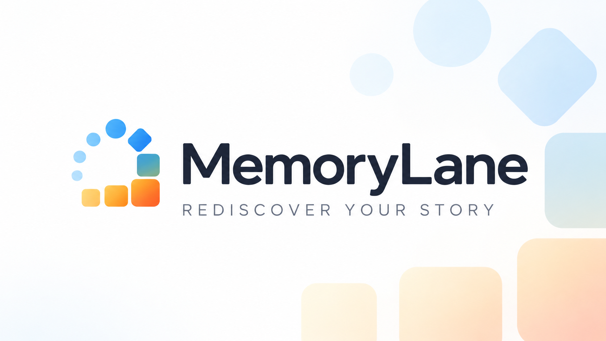

# MemoryLane

[](https://www.memorylaneapp.org/)

### Your photos already hold a lifetime of stories. MemoryLane helps you find them again.

MemoryLane turns large, scattered photo and video collections into a private archive you will actually enjoy exploring. Revisit forgotten days, browse the people and places in your life, search by camera or lens, and surface memories you did not know you were looking for—all without uploading your library to someone else's cloud.

**[Visit memorylaneapp.org →](https://www.memorylaneapp.org/)**

MemoryLane is local-first. It indexes folders in place, builds a disposable SQLite catalog and thumbnail cache, and leaves original media untouched except when you explicitly approve a video-modernization replacement.

## Highlights

- Browse, search, favorite, and rediscover photos and videos from multiple folders.
- Surface forgotten photos through Random Memory, This Day, Another Time, Surprise Me, and fast folder hover previews.
- Explore geotagged photos on an offline map with year and source filters.
- Read camera, lens, focal-length, date, and other EXIF metadata with photographer-focused reports.
- Browse major camera RAW formats, pair matching RAW+JPEG files as one photo, and play Apple Live Photos and video.
- Group bursts into editable stacks and clean up originals through visible, reversible trash folders that keep RAW, Live Photo, and sidecar companions together.
- Install optional first-party plugins for AI search, similar-photo discovery, People, and Apple Photos.
- Inspect cache and index usage and move generated MemoryLane data to another disk without relocating your originals.
- Run from source or use the small Go desktop tray, which starts the server and opens the browser.

MemoryLane is free software under the [MIT License](LICENSE). It is designed to run on hardware you control; optional AI inference also runs locally.

## Run from source

### Requirements

- Node.js 20 or newer
- npm 10 or newer
- Go 1.25 or newer only when developing the desktop tray
- Python 3.11–3.13 only when developing the optional AI or Apple Photos runtime plugins

ExifTool, FFmpeg, FFprobe, and Sharp are installed through npm. A system-wide installation is not required.

```bash
git clone <repository-url>
cd memorylane
npm install
npm run build
npm start
```

Open `http://127.0.0.1:4280`, create the first administrator account, then add scan folders under **Settings**. Copy [.env.example](.env.example) to `.env` to override defaults.

## Development

Run the API and Vite client in separate terminals:

```bash
npm run dev
npm run dev:client
```

The client is available at `http://127.0.0.1:5173` and proxies API requests to the server. For a production-style local run, use `npm run build && npm start`.

Useful checks:

```bash
npm test
npm run typecheck
```

See [Deployment and development](docs/deployment.md) for desktop builds, data locations, configuration, and troubleshooting.

## Plugins

Plugins are first-party signed packages managed by the core server. Source runs load development plugins directly from `plugins/optional/` when no catalog is configured. Packaged releases install from a signed HTTPS catalog.

The core includes metadata/RAW handling, thumbnails, and video tools because every library needs them. Optional packages currently provide:

- **AI Runtime** — local model inference and vector storage
- **AI Search & Similar** — semantic search and visual similarity
- **People** — face detection and grouping
- **Apple Photos** — read-only access to a local macOS Photos library

Read [Plugin architecture](docs/architecture/plugins.md), [AI architecture](docs/architecture/ai.md), and [Plugin repository deployment](docs/plugin-repository-deployment.md) for details.

## Privacy and network access

MemoryLane binds to localhost by default. To allow access from other devices on the LAN, enable **Allow Access outside this computer** under **Settings → Network** and restart MemoryLane. `MEMORYLANE_BIND_ADDRESS` can still override the saved setting. The built-in HTTP server does not terminate TLS; use a trusted reverse proxy before exposing it outside a private network.

## Licensing

MemoryLane is MIT licensed. Bundled tools, libraries, optional models, and their separate terms are documented in [Third-party notices](THIRD_PARTY_NOTICES.md). The optional InsightFace model is restricted to non-commercial research use and is never downloaded unless selected.

Original authors: Madhan Kanagavel and Anis Abdul.
